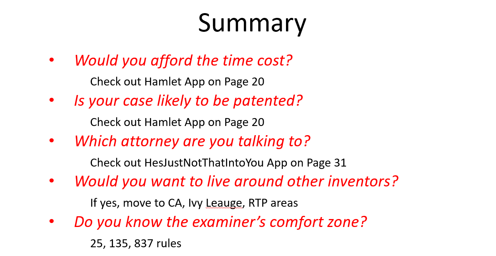

**Please refer to Pattern Patent.pptx for my presentation of project 1 (https://github.com/gongl1/projectdemo1/blob/main/Pattern%20Patent.pptx). The topic USPTO patents is consistent across my project portfolio**.

Steps to access my presentation for projectdemo1_Data:

Please refer to Pattern Patent_ML.pptx for my presentation of Pattern Patent.pptx for my presentation of project (https://github.com/gongl1/projectdemo1/blob/main/Pattern%20Patent.pptx)..
Click on view raw to download the presentation.
This project is about data analysis. The topic USPTO patents is consistent across my project portfolio.

# projectdemo1

## Instructions

Project Proposal

This project is to uncover patterns in successfully patented cases among patent applications to USPTO and their associated inventors and attorneys. 

Data to work with: 
https://www.uspto.gov/learning-and-resources/electronic-data-products/patent-examination-research-dataset-public-pair (For 2019 Release)
https://www.uspto.gov/learning-and-resources/electronic-data-products/patent-claims-research-dataset

Areas to study: 

•	“application_data”: calculate period between filing_date and patent_issue_date to see on average long it takes to issue a patent for different categories. 
        Focus on appl_status_desc and calculate numeric values under “Patented Case”. Study which uspc_class has the most filings and highest patented rate. 
        Study small_entity_indicator to see if there is any implications on small entrepreneurships. 
        
•	“all_inventors”: plot the inventors' geolocation distributions including regions, states and cities.

•	Merge “application_data” and “all_inventors”: study the inventors distribution, create heatmap based on number of applications each state, 
        and use census API to see if there is correlation between state population, poverty and inventors, etc. 
        
•	“attorney_agent”: study which attorneys has the most filings and which are the most successful in patent filings. 

•	"patent_claims_stats”: study claim numbers on each patented case, focus on word counts, character counts, key words count, etc. 

•	Merge “application_data” and “patent_claims_stats”: focus on the claims trend for patented cases. Find out common claim features in patented cases. 

Major findings

Lessons and Learn

Make presentation slides

Run "application_data.ipynb" first.

- - -

- - -

© Liang Gong. Confidential and Proprietary. All Rights Reserved.

